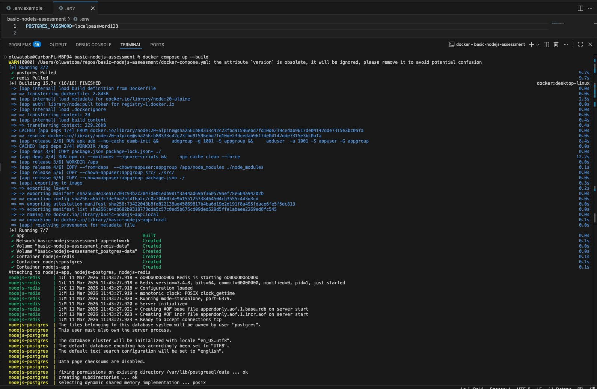
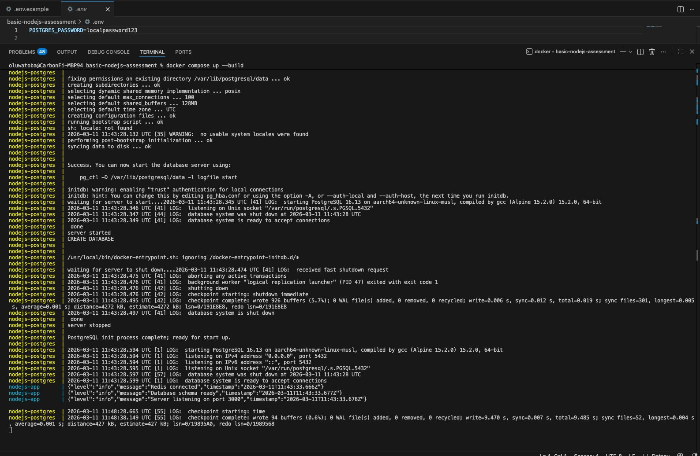
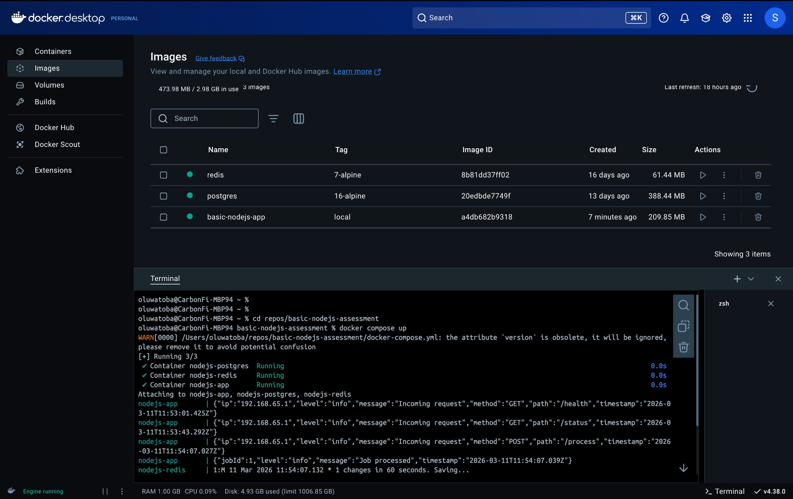
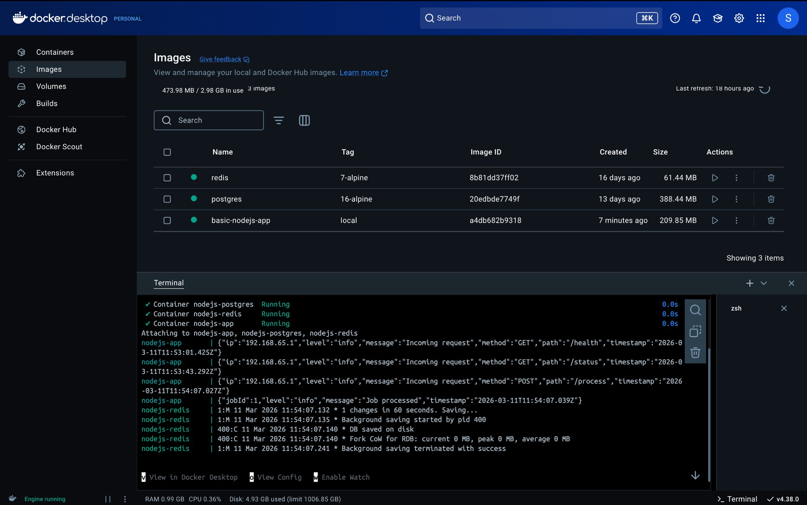
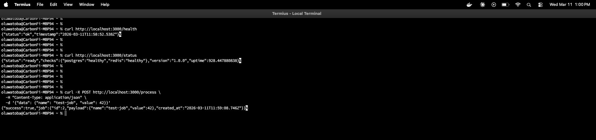

# basic-nodejs-assessment

Production-ready DevOps pipeline for a Node.js REST API, built as part of the CredPal DevOps Engineer assessment.

---

## Table of Contents

1. [Architecture Overview](#architecture-overview)
2. [Repository Structure](#repository-structure)
3. [Running Locally](#running-locally)
4. [Local Demo](#local-demo)
5. [API Endpoints](#api-endpoints)
6. [CI/CD Pipeline](#cicd-pipeline)
7. [Infrastructure (Terraform)](#infrastructure-terraform)
8. [Deployment](#deployment)
9. [Security Decisions](#security-decisions)
10. [Key Design Decisions](#key-design-decisions)

---

## Architecture Overview

```
Internet
   │
   ▼
Route 53 (DNS)
   │
   ▼
ACM (TLS cert)
   │
   ▼
Application Load Balancer  ──► HTTP/80 → redirect to HTTPS/443
   │  (public subnets, 2 AZs)
   ▼ HTTPS/443
ECS Fargate Service
   │  (private subnets, 2+ tasks, rolling deploy)
   ├──► Amazon RDS PostgreSQL  (private subnet)
   ├──► ElastiCache Redis      (private subnet)
   └──► Secrets Manager        (credentials injected at runtime)
         CloudWatch Logs       (structured JSON logs)
```

All application traffic flows over **HTTPS only**. The Node.js container runs as **non-root user (UID 1001)** in a **read-only filesystem**.

---

## Repository Structure

```
basic-nodejs-assessment/
│
├── .github/
│   └── workflows/
│       └── ci-cd.yml               # CI/CD pipeline: test → build/push to ECR → deploy to ECS
│
├── src/
│   └── app.js                      # Express application (GET /health, GET /status, POST /process)
│
├── tests/
│   └── app.test.js                 # Jest unit tests with mocked Postgres & Redis
│
├── terraform/                      # Infrastructure as Code (Terraform ≥ 1.10)
│   ├── bootstrap/                  # ONE-TIME: provisions the S3 remote-state bucket
│   │   ├── main.tf                 #   S3 bucket with versioning, encryption, TLS policy
│   │   ├── variables.tf
│   │   └── outputs.tf
│   │
│   ├── modules/
│   │   ├── vpc/                    # VPC, subnets, IGW, NAT GWs, security groups
│   │   │   ├── main.tf
│   │   │   ├── variables.tf
│   │   │   └── outputs.tf
│   │   ├── compute/                # ECS Fargate cluster, task definition, service, auto-scaling
│   │   │   ├── main.tf
│   │   │   ├── variables.tf
│   │   │   └── outputs.tf
│   │   └── loadbalancer/           # ALB, target group, HTTPS listener, HTTP→HTTPS redirect
│   │       ├── main.tf
│   │       ├── variables.tf
│   │       └── outputs.tf
│   │
│   ├── main.tf                     # Root module: wires VPC + compute + ALB + ACM + Route 53
│   ├── variables.tf                # All input variables with descriptions and defaults
│   ├── outputs.tf                  # ALB DNS, ECS cluster/service names, app URL
│   └── terraform.tfvars.example    # Copy to terraform.tfvars and fill in real values
│
├── Dockerfile                      # Multi-stage build (deps → builder/test → release)
├── docker-compose.yml              # Local stack: app + PostgreSQL + Redis
├── package.json                    # Node.js dependencies and npm scripts
├── .env.example                    # Environment variable template (never commit .env)
├── .gitignore                      # Excludes node_modules, .env, Terraform state/secrets
└── README.md                       # This file
```

### Key files at a glance

| File | Purpose |
|------|---------|
| `src/app.js` | Single-file Express API with graceful shutdown, structured logging, and DB/Redis integration |
| `tests/app.test.js` | 8 Jest tests covering all endpoints and failure paths — no live infrastructure needed |
| `Dockerfile` | 3-stage build; tests run in Stage 2 so a failing test aborts the image build |
| `docker-compose.yml` | Full local environment in one command — app wired to Postgres and Redis with health checks |
| `.github/workflows/ci-cd.yml` | 3-job pipeline: lint/test → ECR push (multi-arch) → ECS rolling deploy with manual approval |
| `terraform/bootstrap/` | Provisions the S3 state bucket before `terraform init` can run in the parent directory |
| `terraform/modules/vpc/` | Network layer — public/private subnets across 2 AZs with NAT gateways |
| `terraform/modules/compute/` | ECS Fargate service with circuit-breaker rollback and CPU-based auto-scaling |
| `terraform/modules/loadbalancer/` | ALB with TLS 1.3, HTTP→HTTPS redirect, and S3 access logging |


## Running Locally

### Prerequisites

- Docker ≥ 24 and Docker Compose v2
- Node.js ≥ 20 (only needed to run tests without Docker)

### 1 – Clone and configure

```bash
git clone https://github.com/your-org/basic-nodejs-assessment.git
cd basic-nodejs-assessment

# Copy the example env file and set a password
cp .env.example .env
# Edit .env — at minimum set POSTGRES_PASSWORD
```

### 2 – Start everything with Docker Compose

```bash
npm install - # This creates package-lock.json
docker compose up --build
```

This starts:
| Service  | Internal host | Exposed port |
|----------|---------------|--------------|
| Node app | `app`         | `3000`       |
| Postgres | `postgres`    | *(internal)* |
| Redis    | `redis`       | *(internal)* |

The app is available at **http://localhost:3000**.

### 3 – Run tests (without Docker)

```bash
npm install
npm test
```

All tests use mocked Postgres and Redis, so no live services are needed.

---

## Local Demo

The screenshots below show the full local run from a clean machine.

### Step 1 — `docker compose up --build` kicks off

Docker pulls `node:20-alpine`, installs dependencies via `npm ci`, and builds the multi-stage image. Postgres and Redis images are pulled in parallel.



---

### Step 2 — Build completes, all containers created

All 16 build steps finish successfully. Docker creates the network, volumes, and spins up all 3 containers: `nodejs-redis`, `nodejs-postgres`, and `nodejs-app`.



---

### Step 3 — App is fully live and accepting requests

The app logs confirm the full boot sequence in order:
- `Redis connected`
- `Database schema ready` (the `jobs` table is created automatically)
- `Server listening on port 3000`



---

### Step 4 — All 3 containers visible in Docker Desktop

Docker Desktop confirms all three images (`basic-nodejs-app:local`, `postgres:16-alpine`, `redis:7-alpine`) are built and the containers are running. The structured JSON request logs from the app are also visible in the Docker Desktop terminal.



---

### Step 5 — All 3 API endpoints tested and passing

All endpoints return the expected responses:

| Endpoint | Method | Result |
|----------|--------|--------|
| `/health` | `GET` | `{"status":"ok","timestamp":"..."}` |
| `/status` | `GET` | `{"status":"ready","checks":{"postgres":"healthy","redis":"healthy"},...}` |
| `/process` | `POST` | `{"success":true,"job":{"id":2,"payload":{"name":"test-job","value":42},...}}` |



---

### `GET /health`
Liveness probe — always returns `200` if the process is alive.

```json
{ "status": "ok", "timestamp": "2026-03-11T10:00:00.000Z" }
```

### `GET /status`
Readiness probe — checks PostgreSQL and Redis connectivity.

```json
{
  "status": "ready",
  "checks": { "postgres": "healthy", "redis": "healthy" },
  "version": "1.0.0",
  "uptime": 42.5
}
```

Returns `503` with `"status": "degraded"` if any dependency is unhealthy.

### `POST /process`
Persists a job to Postgres and caches it in Redis.

**Request:**
```json
{ "data": { "key": "value" } }
```

**Response `201`:**
```json
{
  "success": true,
  "job": { "id": 1, "payload": "{\"key\":\"value\"}", "created_at": "..." }
}
```

**Response `400`:** Missing `data` field.
**Response `500`:** Database write failure.

---

## CI/CD Pipeline

File: `.github/workflows/ci-cd.yml`

```
Push / PR to main
       │
       ▼
  ┌──────────┐
  │  test     │  install deps → lint → jest (coverage) → npm audit
  └──────────┘
       │ (pass)
       ▼ (push to main only)
  ┌──────────────┐
  │  build-push  │  OIDC auth → ECR login → docker buildx (amd64 + arm64)
  │              │  → push to AWS ECR → Trivy vulnerability scan
  └──────────────┘
       │
       ▼ (manual approval gate)
  ┌────────────────────┐
  │  deploy-production │  download task def → swap image URI → register new
  │                    │  revision → ECS rolling deploy → /health smoke test
  └────────────────────┘
```

### GitHub Secrets required

| Secret                  | Purpose                                                      |
|-------------------------|--------------------------------------------------------------|
| `AWS_DEPLOY_ROLE_ARN`   | ARN of the IAM role assumed via OIDC (no long-lived keys)    |
| `AWS_ACCOUNT_ID`        | AWS account number — used to construct the ECR registry URI  |
| `AWS_REGION`            | e.g. `us-east-1`                                             |
| `APP_DOMAIN`            | e.g. `api.credpal.com` — used for the post-deploy smoke test |

> **No static AWS keys** — the pipeline authenticates with AWS using **OIDC** (`id-token: write` permission). GitHub exchanges a short-lived token for temporary AWS credentials by assuming the role in `AWS_DEPLOY_ROLE_ARN`. This removes the need to store `AWS_ACCESS_KEY_ID` / `AWS_SECRET_ACCESS_KEY` as secrets entirely.

> **Manual approval:** The `deploy-production` job targets a GitHub **Environment** named `production`. Add required reviewers in *Settings → Environments → production* to enforce a human gate before every production deploy.

---

## Infrastructure (Terraform)

Located in `terraform/`.

### Modules

| Module         | Resources created                                        |
|----------------|----------------------------------------------------------|
| `vpc`          | VPC, subnets (public/private), IGW, NAT GWs, route tables, security groups |
| `compute`      | ECS cluster, task definition, Fargate service, IAM roles, CloudWatch log group, auto-scaling |
| `loadbalancer` | ALB, target group, HTTP→HTTPS redirect listener, HTTPS listener, S3 access-log bucket |

Root module also provisions: ACM certificate (DNS-validated), Route 53 A record, Secrets Manager secret.

### Deploy infrastructure

#### Step 1 – Bootstrap the remote state bucket (one-time only)

The S3 bucket that holds Terraform state must exist *before* `terraform init` can configure the S3 backend. The `bootstrap/` sub-module creates it using **local state** (the only safe option at this point).

```bash
cd terraform/bootstrap

terraform init          # local state — commit bootstrap/terraform.tfstate to git
terraform apply         # creates the S3 bucket with versioning + encryption
```

The bucket is created with:
- **Versioning enabled** — recover any previous state version if something goes wrong
- **AES-256 server-side encryption** — state files can contain sensitive values
- **Public-access block** — the bucket is never world-readable
- **TLS-only bucket policy** — all HTTP (non-TLS) requests are denied
- **Lifecycle rule** — non-current versions are expired after 90 days to control cost

> **Locking:** Terraform ≥ 1.10 writes a `.tflock` object alongside the state file in S3 for concurrency locking. No DynamoDB table is required.

#### Step 2 – Initialise and deploy the main stack

```bash
cd ../          # back to terraform/

# Initialise — downloads providers and configures the S3 backend
terraform init

# Copy and fill in real values
cp terraform.tfvars.example terraform.tfvars

# Preview
terraform plan -var-file=terraform.tfvars

# Apply
terraform apply -var-file=terraform.tfvars
```

---

## Deployment

### Zero-downtime rolling deployment (ECS)

The ECS service is configured with:
- `deployment_minimum_healthy_percent = 100` — never reduce running tasks below desired count
- `deployment_maximum_percent = 200` — spin up new tasks before draining old ones
- `deployment_circuit_breaker` with `rollback = true` — auto-rolls back on repeated health-check failures

ALB deregistration delay is set to **30 seconds** to drain in-flight connections before a task is terminated.

### Manual production approval

The GitHub Actions `deploy-production` job requires approval from a designated reviewer (configured in the GitHub Environment). No code reaches production without a human sign-off.

---

## Security Decisions

| Concern | Decision |
|---------|----------|
| **Secrets** | All credentials (DB password, etc.) are stored in **AWS Secrets Manager** and injected at task start. Nothing sensitive lives in environment variables, Dockerfiles, or source code. |
| **HTTPS** | ACM TLS certificate with DNS validation. ALB listener uses `ELBSecurityPolicy-TLS13-1-2-2021-06` (TLS 1.3 preferred, TLS 1.2 minimum). HTTP/80 is redirected to HTTPS/443. |
| **Non-root container** | Dockerfile creates `appuser` (UID 1001) and switches to it in the final stage. ECS task definition enforces `"user": "1001"`. |
| **Read-only filesystem** | `readOnlyRootFilesystem: true` in the ECS task definition. `/tmp` is a `tmpfs` mount in Docker Compose. |
| **Network isolation** | ECS tasks run in **private subnets** with no public IP. Only the ALB (public subnets) accepts internet traffic. DB/Redis have no public exposure. |
| **Image scanning** | Trivy scans the built image on every push to `main`. CRITICAL/HIGH CVEs fail the pipeline. |
| **npm audit** | `npm audit --omit=dev --audit-level=high` runs in CI. |
| **No secrets in GitHub** | GitHub Actions reads AWS credentials from repository secrets. Image tags and build args contain no credentials. |
| **ALB hardening** | `drop_invalid_header_fields = true` and `enable_deletion_protection = true`. |

---

## Key Design Decisions

**ECS Fargate over EC2**
Fargate removes the need to manage, patch, or right-size EC2 instances. The compute module can be swapped for EC2/ECS or EC2 Auto Scaling Groups with minimal changes to the rest of the infrastructure.

**Multi-stage Dockerfile**
Stage 1 (`deps`) installs production dependencies only. Stage 2 (`builder`) runs tests inside the image build, so a failing test prevents a broken image from being pushed. Stage 3 (`release`) is the minimal runtime image with `dumb-init` for correct PID 1 signal handling.

**AWS Elastic Container Registry (ECR)**
The pipeline pushes images to ECR rather than a third-party registry. This keeps the entire delivery chain within AWS — the same account, the same IAM boundary, and the same VPC that ECS pulls from. ECR also provides built-in image scanning on push (`scanOnPush=true`), lifecycle policies, and cross-region replication without extra credentials to manage.

**Multi-platform image build (`linux/amd64` + `linux/arm64`)**
A single manifest list is pushed to ECR covering both CPU architectures. This matters for two concrete reasons:

1. **AWS Graviton cost savings** — ECS Fargate on `ARM64` (Graviton2/3) is typically 20 % cheaper and up to 40 % more energy-efficient than equivalent x86 tasks. Because the image already contains an `arm64` layer, switching a Fargate task from `X86_64` to `ARM64` requires changing one field in the task definition — no code changes, no rebuild.

2. **Local development on Apple Silicon** — engineers running Docker on M1/M2/M3 Macs pull the native `arm64` layer automatically. Without it, Docker falls back to QEMU emulation which is noticeably slower for `npm install`, test runs, and hot-reload workflows.

QEMU is installed on the GitHub Actions runner via `docker/setup-qemu-action` so the `arm64` layer is cross-compiled transparently during the CI build — no dedicated ARM runner is needed.

**Structured JSON logging (Winston)**
Every log line is a JSON object with `timestamp`, `level`, `message`, and context fields. This enables CloudWatch Logs Insights queries and downstream ingestion by tools like Datadog or OpenSearch without any additional parsing.

**Auto-scaling**
An ECS Application Auto Scaling policy scales the service between `desired_count` and 10 replicas based on average CPU utilisation (target: 70 %). This handles traffic spikes without manual intervention.

**Terraform S3 remote state with native locking**
State is stored in S3 (versioning + AES-256 encryption). Terraform ≥ 1.10's `use_lockfile = true` writes a `.tflock` object alongside the state file for concurrency locking — no DynamoDB table required. A `bootstrap/` module provisions the bucket before the main stack runs, solving the chicken-and-egg initialisation problem.
